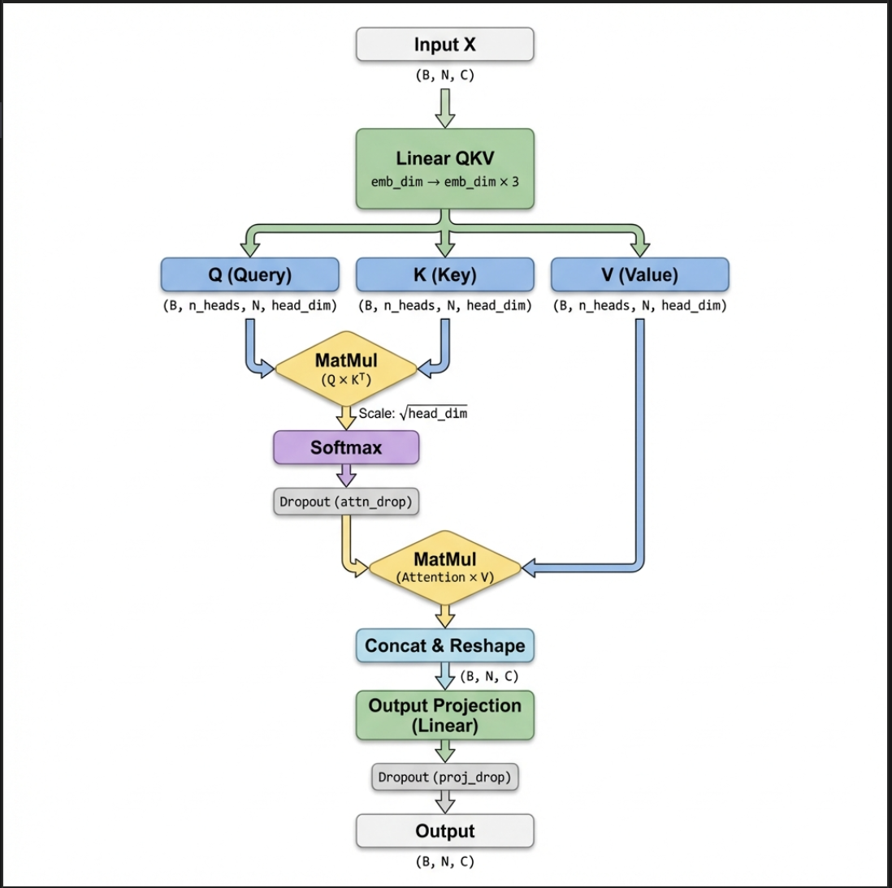
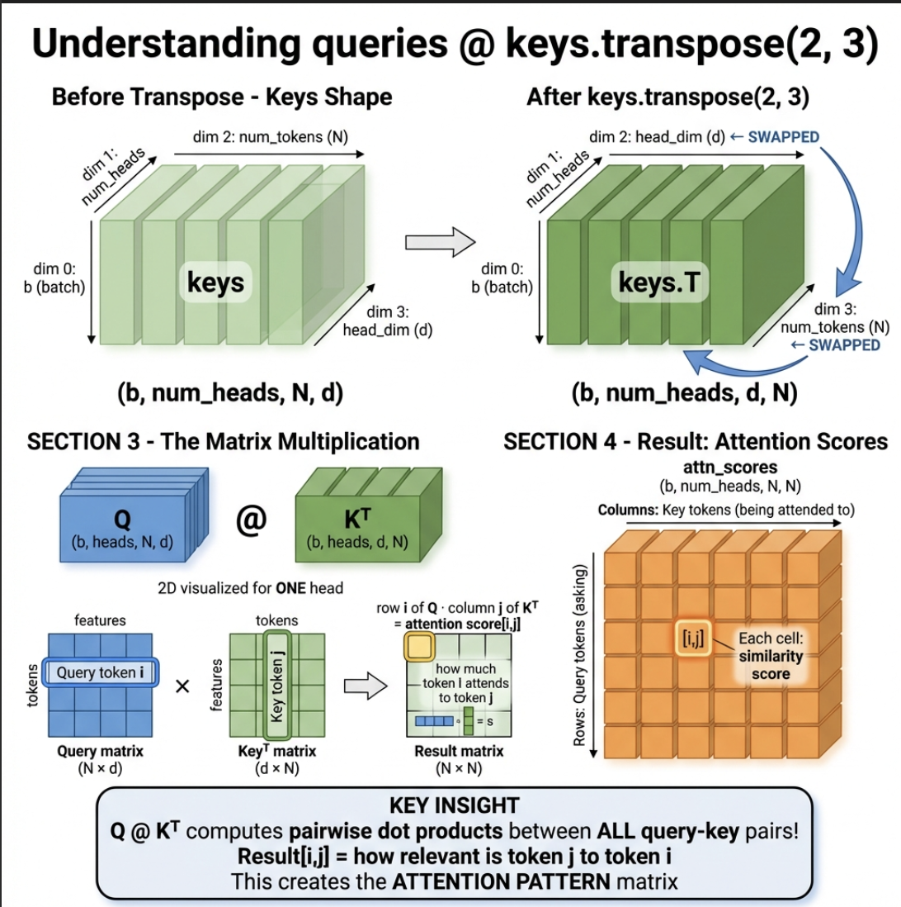

# Spam Classifier: Transformer from Scratch (Fine-Tuning GPT-2)

This repository contains a modular implementation of a Spam Classifier built on top of the GPT-2 (124M) architecture. Instead of just using a library, this project demonstrates how to load pretrained OpenAI weights into a custom-built Transformer structure and fine-tune it for a specific classification task.

## 🚀 Overview

The classifier uses the **GPT-2 124M** model as a backbone. We modify the final output head to transform the generative model into a binary classifier (Spam vs. Ham).

### Architecture Highlights
- **Multi-Head Attention**: Implemented from scratch to handle contextual relationships in text.
- **GPT-2 Backbone**: Leveraging 12 layers and 12 heads of pretrained power.
- **Classification Head**: A linear layer that processes the last token's output to determine the class.


*Figure 1: Visualization of the Multi-Head Attention mechanism used in the model.*

## ✨ Key Features

- **Pretrained Weights**: Directly loads original OpenAI GPT-2 weights (via TensorFlow checkpoints) into PyTorch.
- **Balanced Dataset**: Implements **Undersampling** (matching 'ham' count to 'spam' count) to ensure the model doesn't become biased towards the majority class.
- **Dynamic Padding**: Automatically calculates the longest sentence in your training set and pads all inputs to that exact length for maximum performance.
- **Metadata Persistence**: Saves training metadata (`max_length`) so the prediction script always stays perfectly aligned with the trained model.
- **Interactive Inference**: A standalone prediction script to test the model on any text input.

## 📁 Project Structure

- `main.py`: The orchestrator—downloads weights/data, treats the model, and runs the training loop.
- `model.py`: The heart of the project—defining the GPT architecture, Attention mechanisms, and Transformer blocks.
- `predict.py`: Standalone script for interactive spam detection.
- `dataset.py`: Handles data loading, tokenization, and dynamic padding.
- `utils.py`: Data preparation, undersampling logic, and tokenizer initialization.
- `train.py`: The fine-tuning logic and loss functions.
- `config.py`: Centralized hyperparameters for the GPT-2 124M model.
- `weights.py`: Helper logic to map TensorFlow checkpoint tensors to PyTorch parameters.

## 🛠️ Installation

1. **Clone the repository**:
   ```bash
   git clone https://github.com/sh-arka22/Spam-Classifier-Tranformer-From-Scratch.git
   cd Spam-Classifier-Tranformer-From-Scratch
   ```

2. **Create a virtual environment**:
   ```bash
   python -m venv env
   source env/bin/activate  # On Windows: env\Scripts\activate
   ```

3. **Install dependencies**:
   ```bash
   pip install -r requirements.txt
   ```

## 📈 Usage

### 1. Training the Model
Run the main script to download the GPT-2 weights, prepare the balanced dataset, and start fine-tuning:
```bash
python main.py
```
After training, the model will be saved as `spam_classifier_model.pth` and metadata as `model_metadata.txt`.

### 2. Predicting Spam
Once the model is trained, use the interactive prediction script:
```bash
python predict.py
```
Enter any text message to see if the model classifies it as **🔴 SPAM** or **🟢 NOT SPAM**.

---

### Visualization

*Figure 2: Representation of GPT-2 components and weight loading logic.*

## 📊 Dataset
This project uses the [UCI SMS Spam Collection](https://archive.ics.uci.edu/ml/datasets/SMS+Spam+Collection), which is automatically downloaded and processed during the first run.

## 🧠 Learning Goals
- Understand the internal mechanics of GPT-2.
- Learn how to bridge the gap between different frameworks (TensorFlow checkpoints to PyTorch).
- Mastering fine-tuning techniques for sequence classification.
